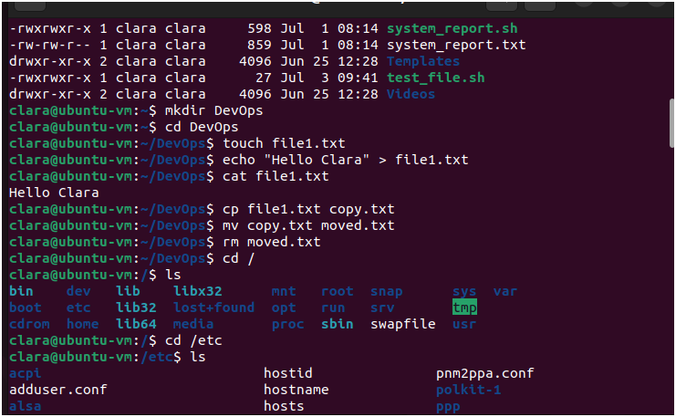

# 📅 Day 1 – Linux Basics

## ✅ Topics Covered

- Basic Linux commands
- Linux file system structure
- User & group management
- File permissions & ownership

## 💻 Practice Snippets

```bash
# Navigation
pwd
ls
mkdir DevOps
cd DevOps

# Files
touch file1.txt
echo "Hello Clara" > file1.txt
cat file1.txt

# Permissions
chmod 755 file1.txt
chown $USER:$USER file1.txt

# Users
sudo adduser testuser
sudo passwd testuser
id
whoami


